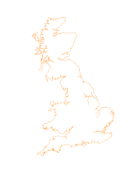

# siskin
An approach to the creation of an ab initio transport network model for Great Britain

## Base Population and Geography

The population geography is based on the mid-year 2020 population estimates for Scotland, England and Wales. Where these are the latest published population estimates.

The census geography is projected on to a [Universal Transverse Mercator (UTM)](https://en.wikipedia.org/wiki/Universal_Transverse_Mercator_coordinate_system) coordinate system to allow distance and area calculations in metres, rather than longitude/latitude. Using the [European Petroleum Survey Group](https://en.wikipedia.org/wiki/EPSG_Geodetic_Parameter_Dataset) [EPSG 32630 projection](https://epsg.io/32630) for the UK. Following devolution, population estimates for England and Wales, and Scotland are maintained separately, and the different Scots Data-Zone (DZ) and English and Welsh Output Area (OA) census geographies are mapped.

### Scotland
Download Scotland mid-year population estimates 2020 in Data-Zones (DZ) and map to the 2011 Census Output Area (OA) geographies

1.   Extract the Data-Zone 2020 mid-year population estimates data from National Records of Scotland zip archive [here](https://www.nrscotland.gov.uk/files/statistics/population-estimates/sape-20/) and extract the Data-Zone data population estimates into a `CSV` file
2.   Map the Data-Zone and OutputArea using the National Records of Scotland lookup file [here](https://www.nrscotland.gov.uk/files/geography/2011-census/OA_DZ_IZ_2011.xlsx)
3.   Download the 2011 ESRI ShapeFile Output Area Mid-Half-Water (MHW) census geography from National Records of Scotland [here](https://www.nrscotland.gov.uk/files/geography/output-area-2011-mhw.zip)
4.   Project the shapefile census geography to a `EPSG:32630` format `GeoPackage` file

### England and Wales
Download the latest mid-year population estimates in 2011 Census Output Area (OA) geographies from the Office of National Statistics (ONS). The OA mid-year population estimate data for England is split into nine region.

1.    Page scrape, download and extract the Output Area 2020 mid-year population estimates data for the ONS regions in England and Wales under [here](https://www.ons.gov.uk/peoplepopulationandcommunity/populationandmigration/populationestimates#datasets) in `XLSX` format into 10 `TSV` files
2.   Download the 2011 ESRI ShapeFile Output Area Mid-Half-Water (MHW) census geography in `GeoJSON` from Office of National Statistics ArcGIS API server [here](https://services1.arcgis.com/ESMARspQHYMw9BZ9/ArcGIS/rest/services/Output_Areas_December_2011_Boundaries_EW_BFC/FeatureServer/0)
4.   Project the shapefile census geographies to a `EPSG:32630` format `GeoPackage` file

### Combine Population and Geography

 

The Output Area (OA) population boundary is created by transforming the Scots from Data-Zone to OA and combining this with the English and Wales to create an OA layer `GeoPackage` file. Combining this OA data to create Super Output Area (LSOA) and Middle Super Output Area (MSOA) layers, see ONS coding systems [here](https://en.wikipedia.org/wiki/ONS_coding_system), Additional OA centroid and Great Britain boundary layers.

## Create 64 arbitrary regions
## batchkmeans7
Applying the `sklearn` KMeans clustering algorithm MiniBatchKMeans algorithm to the census Output Area (OA) population data to split the geography into 64 clusters
https://scikit-learn.org/stable/modules/generated/sklearn.cluster.MiniBatchKMeans.html

The OA geography centroids weight based on population^2 labels the 64 cluster centres and OA geography regions. These labeled centroid point layer are linked to the OA geography and aggregated to give 64 regional geographies.

However, the KMeans centroid points geography have issues with disconnected geographies, for example where there are rivers, estuaries or islands.

To address this the next step is to split aggregated OA regional geographies at these geographical features, re-label on the following criteria and re-aggregate into 64 adjusted geographies:

1. aggregate all sub-region within a kmeans OA region that have an area smaller than 1 km^2 and greater 500 km^2
2. Join the remaining regions to cluster label by longest shared-edge length.
3. Where no shared edge exists leave the cluster label

Aggregate using this adjusted cluster label and calculate the associated population, and identify a logical centre based Middle Super Output Area (MSOA) density.

Alternative batch OA KMeans weights investigated were:
1. distance
2. population
3. population^2
4. density * population
5. density * population^2
6. 1 / area

## east-midlands
Having identified the regions that make up the East-Midlands from the 64 regions above, (labels 1, 10, 15, 21, 34, 45, 48), create a population and population density heatmap centroid point and geography layers, consisting of squares edge-length 128m and 2km (area ~0.164m^2 and 4.194 km^2 respectively).

## batchkmeans-em
Apply the `sklearn` KMeans clustering algorithm MiniBatchKMeans algorithm to the 1,299,312 points in the 128m point layer for the East Midlands layer from the previous heatmap, to create 1024 sub-regions.

Aggregate these sub-regions to create new centroid point and associate Voronoi polygons layers bounded by the East-Midlands geography. Voronoi polygons are created using the [pysal](https://pysal.org) `voronoi_frames` implementation

## clusters2

Adjust the 1024 sub-region boundaries from the prior KMeans clustering to remove internal features, such as rivers, at a distance of about 1km from the outer geographic boundary, and the associated centroid points to sit within these boundaries.

Identify and aggregate sub-regions with a population > 10k up to a centroid distance of about 64km to form 45 grouped urban population centres using the `sklearn` `AgglomerativeClustering` algorithm. This recursively merges pair of clusters of sample data up to a maximum linkage distance.

Use the Python Spacial Analysis Library `Delaunay` algorithm to create a Delaunay network to connect between the 1024 centroid with edges pruned to sit within the region boundary. This provides edges to connect the urban population centres in the next step.

Create a second shortest path Delaunay network between the 45 grouped urban population centres and using edges connecting the pruned 1024 node sub-region network.

Calculate the transport demand edge-weight from the product of the source and target population between the 45 grouped urban population centres divided by edge length.

Recursively apply the `NetworkX` network analysis `preflow_push` algorithm to calculate a shortest-path network edge weight as follows:

* Use the `preflow_push` algorithm to calculate maximum single-commodity flow between each pair of the 45 grouped urban population centres
* Sum these directional flow values to calculate total flow between the 45 grouped urban population 
* Sum the directed flow to calculate the undirected flow value
* Sum the flow across each shared edge in the shortest-path network

The expected passenger flow is then scaled as a fraction of the total trips per day and per hour of the total sum of the edge flow weights

## Rail Modal Share

The Department of [Transport Trip End Model Presentation Program (TEMPro) software](https://www.gov.uk/government/publications/tempro-downloads) allows users to forecast trips by geographical area, transport mode and years of interest until 2051

We use 2050 TEMPro model estimates of 12.47M total trips per day and 2.94M total number of trips at AM peak (07:00-10:00) to scale the total calculated East Midlands edge flow weights and then with an ambitious peak time range of 25% and 35% in 2050 for rail modal share as discussed below

### East Midlands Rail Trip Modal Share Estimates 

Active and rail modal share in the East Midlands is low when compared to regions with much higher public transport provision such as London:

|AM Peak 2021|London|East Midlands|
|------------|------|-------------|
|Walking     |   24%|          22%|
|Cycling     |    2%|           2%|
|Car*        |   39%|          67%|
|Bus/Coach   |   15%|           7%|
|Rail        |   19%|           2%|

\* driver or passenger

As the current East Midlands modal share is likely too low, investment in a denser rail network would increase modal share if only by making more rail journeys available

A dense rail network with faster rail journeys is likely to displace medium-long journey rather than short bus or car journeys, noting that a dense rail network will never compete the number of bus or tram pick-up locations

It is then unrealistic to  100% of trips to will not be by rail as, for example, the most dense rail network would only displace very few walking and cycling trips

While London car mode share is still significant, public transport share is 3.7 times more in London compared to the East Midlands, 

Reflecting a 2050 target which reduces the total amount of energy required for transport purposes to deliver climate change targets suggests a greater use of public/collective transport and reduced use of personal transport suggesting a plausible rail modal share between current peak usage of 25% and 35% 

### International Comparisons

While international comparisons are hard due to differing data collection and classification. As the Japanese data does not include active travel, a comparison with the previous UK data excluding active travel

|Mode  |London|East Midlands|Japan|
|------|------|-------------|-----|
|Car   |   53%|          88%|  34%|
|Bus   |   21%|           9%|   6%|
|Rail* |   26%|           3%|  60%|

\* includes subway and metro journeys

From [Urban Japan 2009 Passengers Carried within Three Largest Cities](https://www.stat.go.jp/english/data/nenkan/65nenkan/1431-13.html)

## Future Development

TEMPro is being developed to include a range of future 'Common Analytical Scenarios' to account for current uncertainties in behaviour and economic circumstances arising from Covid, climate change, war et al, and when finished should be used to update the estimates used  

England and Wales travel-to-work 2011 and 2021 Census flow Middle-Super Output Area (MSOA) data should also be explored as a way to provide separate travel flow estimates.    

# Notes

## heatmap4
The heatmap4 code breaks the national geography into a series of 4km^2 and 64km^2 square population and density heatmaps. This national heatmap was used during development and testing but is not needed

## network-all
The network-all consists of the many test cases and algorithms used to develop the approach used in the the cluster and flow implementation.
